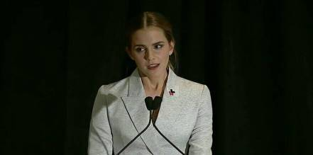

===========================================
Gender Equality -- Excerpt (Emma Watson)
===========================================

.. note:: 
    :ref:`Click into the Vocabulary <Gender-Equality>` 

I was **appointed** six months ago, and the more I have spoken about **feminism**, the more I have realize that fighting for women's rights has too often become **synonymous with man-hating**. If there is one thing I know for **certain**, it is that this has to stop. 

**For the record**, feminism by definition is " The belief that men and women should have equal rights and **opportunities**. It is the theory of the **political**, **economic** and social equality of sexes." I started questioning **gender-based** **assumptions** a long time ago. When I was eight, I was confused to be called '**bossy**', because I wanted to direct the plays we should put on for our parents but the boy were not.

When I was 14, I started being **sexualized** by **certain** elements of the media. When I was 15, my girlfriends started **dropping out** of their sports team, because them didn't want to appear "**muscly**". When I was 18, my male friends were unable to express their feelings. 

I decided that I am a feminist and this seemed **uncomplicated** to me. But my **recent** research has shown me that feminism has become an unpopular word. Women are choosing not to identify as feminist. **Apparently**, I am among the ranks of women whose expressions are seem as too strong, too aggressive, isolating, anti-men, unattractive.

Why has the world become such an uncomfortable one?